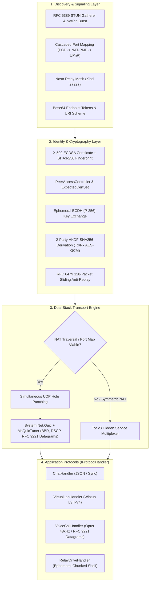

# QuicPunch Documentation Hub

> **QuicPunch** is an enterprise-grade, zero-configuration P2P networking library built for .NET 11. It establishes authenticated, direct peer-to-peer UDP/QUIC tunnels through NATs/firewalls and transparently falls back to an embedded Tor v3 Hidden Service mesh network.

---

### Metadata & Quick Reference

| Property | Value |
| :--- | :--- |
| **Project Name** | QuicPunch (Core Library & Integration Test Suite) |
| **Runtime Target** | .NET 11.0 / C# 14 (Native AOT & Trimming Compatible) |
| **Primary Transports** | WAN/UDP (RFC 5389 STUN + ICE-like Simultaneous Hole Punching + `System.Net.Quic` + RFC 9221 Datagrams), Tor v3 Onion Services |
| **Native MsQuic Tuning** | Deep reflection tuning for Linux/Windows: dynamic BBR congestion control, DSCP QoS (Voice EF 46 / Video AF41 34), microsecond `QuicStatisticsV2` telemetry |
| **Security Architecture** | Self-signed X.509 + SHA3-256 Public Key Pinning + Ephemeral ECDH (NIST P-256) + 2-Party HKDF-SHA256 + AES-GCM-256 + RFC 6479 Sliding Anti-Replay + `IPeerAccessController` zero-trust admission |
| **Signaling Systems** | Nostr Relays (Kind 27227, BIP-340 Schnorr over secp256k1), Direct Base64 Endpoint Tokens, LAN Discovery, Cascaded Gateway Port Mapping (PCP RFC 6887 -> NAT-PMP RFC 6886 -> UPnP IGD) |
| **Virtual Networking** | Embedded Wintun L2/L3 Driver Wrapper for ZeroTier/Hamachi-style Virtual LANs |
| **Included Protocols** | Direct Chat, Virtual LAN Bridge, Low-latency Voice Call (Opus 48kHz over RFC 9221 datagrams), RelayDrive Ephemeral File Shelf |

---

## Documentation Directory Map

```
doc/
├── README.md                                  # You are here: Master Index & Hub
│
├── architecture/
│   ├── overview.md                            # Global architecture, dual-stack WAN/Tor transport layer
│   ├── cryptography-and-security.md           # Cryptographic identity, key derivation, replay protection, PeerAccessController
│   └── lifecycle-and-state-machine.md         # Lifecycle states, generational tracking, glare arbitration
│
├── core/
│   ├── quicpunch-facade.md                    # Core engine, builder pattern, PeerInfo, packed flags, WAN/Tor subservice controls
│   ├── packet-pipeline.md                     # Binary packet serialization, parsing, message handlers
│   ├── connection-and-holepunch.md            # Hole punching orchestration, candidate racing, QUIC TLS, MsQuicDatagramChannel
│   ├── quic-telemetry-and-tuning.md           # Native MsQuic telemetry, QUIC_STATISTICS_V2, BBR/CUBIC switching, WebUI polling
│   └── helpers-and-utilities.md               # MsQuicTuner, MsQuicDatagrams, PeerAccessController, RotatingFileLogger, OpusVoiceCodec, AntiReplayWindow, CertManager
│
├── discovery/
│   ├── stun-and-nat.md                        # RFC 5389 STUN client, PortMappingCoordinator (PCP/NAT-PMP/UPnP), NatPinCoordinator, candidate cache
│   └── nostr-signaling.md                     # Nostr relays, BIP-340 Schnorr signatures, decentralized rendezvous
│
├── tor/
│   ├── tor-subsystem.md                       # Managed Tor daemon, SOCKS5, ControlPort, v3 Onion services
│   └── tor-peer-transport.md                  # Tor peer multiplexer, dummy QUIC lane emulation, streams
│
├── wintun/
│   └── virtual-network-adapter.md             # Wintun native driver wrapper, ring buffers, L3 TUN adapter
│
├── protocols/
│   ├── chat-protocol.md                       # Structured JSON messaging, delivery receipts, history sync
│   ├── virtual-lan-protocol.md                # L3 IP tunnel, broadcast relaying, deterministic IP assignment
│   ├── voice-call-protocol.md                 # QUIC session gating + RFC 9221 datagram plane + Opus 48kHz codec
│   └── relay-drive-protocol.md                # Ephemeral file shelf, chunked streaming, SHA-256 validation
│
├── webui-and-apps/
│   └── webui-backend-and-gui.md               # Embedded HTTP/WebSocket server, modular REST modules, Photino native GUI, AppPreferencesStore
│
└── testing/
    └── test-suite.md                          # 16-suite CLI integration test suite (Anti-replay, security, MsQuic tuning, Tor, STUN burst)
```

---

## Global System Architecture Flow



---

## Component Highlights & Direct Links

| Section | Focus Areas | Key Code Symbols / Files |
| :--- | :--- | :--- |
| **[Architecture Overview](architecture/overview.md)** | Dual WAN/Tor Stack, Zero-Trust Model, Glare Arbitration, MsQuic Tuning | [`QuicPunch`](../QuicPunch/QuicPunch.cs), [`QuicPunchConnection`](../QuicPunch/QuicPunchConnection.cs), [`MsQuicTuner`](../QuicPunch/Helpers/MsQuicTuner.cs) |
| **[Cryptography and Security](architecture/cryptography-and-security.md)** | Certificate Pinning, Ephemeral Entropy, Replay Window, Access Control | [`CertManager`](../QuicPunch/Helpers/CertManager.cs), [`AntiReplayWindow`](../QuicPunch/Helpers/AntiReplayWindow.cs), [`PeerAccessController`](../QuicPunch/Security/PeerAccessController.cs), [`PeerInfo`](../QuicPunch/Structures/PeerInfo.cs) |
| **[Lifecycle & State Machine](architecture/lifecycle-and-state-machine.md)** | Generational Tracking, Token Lifecycles, Glare Resolution | [`QuicPunchLifecycleState`](../QuicPunch/QuicPunch.cs), [`OutboundNegotiation`](../QuicPunch/QuicPunch.cs) |
| **[Core Facade](core/quicpunch-facade.md)** | QuicPunch Main API, Builder, Structures, Subservice Controls | [`QuicPunchBuilder`](../QuicPunch/QuicPunchBuilder.cs), [`PackedFlags`](../QuicPunch/Structures/PackedFlags.cs), [`QuicPunch`](../QuicPunch/QuicPunch.cs) |
| **[Packet Pipeline](core/packet-pipeline.md)** | Binary Serialization, Handshake, Disconnect, Hello Handlers | [`PacketBuilder`](../QuicPunch/PacketHandler/PacketBuilder.cs), [`HelloHandler`](../QuicPunch/PacketHandler/HelloHandler.cs) |
| **[Connection & Hole Punch](core/connection-and-holepunch.md)** | Simultaneous Hole Punching, Socket Reuse, QUIC Handshake, RFC 9221 Datagrams | [`QuicPunchConnection`](../QuicPunch/QuicPunchConnection.cs), [`MsQuicDatagramChannel`](../QuicPunch/Helpers/MsQuicDatagrams.cs) |
| **[Helpers & Utilities](core/helpers-and-utilities.md)** | Native MsQuic BBR/DSCP Tuner, Datagram Channel, Rotating File Logger, Opus Codec, Peer Store | [`MsQuicTuner`](../QuicPunch/Helpers/MsQuicTuner.cs), [`MsQuicDatagramChannel`](../QuicPunch/Helpers/MsQuicDatagrams.cs), [`RotatingFileLogger`](../QuicPunch/Helpers/RotatingFileLogger.cs), [`OpusVoiceCodec`](../QuicPunch/Helpers/OpusVoiceCodec.cs), [`PeerStore`](../QuicPunch/Helpers/PeerStore.cs) |
| **[MsQuic Native Telemetry](core/quic-telemetry-and-tuning.md)** | `QUIC_STATISTICS_V2`, Dynamic BBR/CUBIC Congestion Switching, WebUI REST & Polling | [`MsQuicTuner`](../QuicPunch/Helpers/MsQuicTuner.cs), [`QuicConnectionTelemetry`](../QuicPunch/Helpers/MsQuicTuner.cs), [`StatusApiModule`](../QuicPunchTests/WebUi/Modules/StatusApiModule.cs) |
| **[STUN & NAT Discovery](discovery/stun-and-nat.md)** | Binary RFC 5389 Parser, Cascaded Port Mapping (PCP/NAT-PMP/UPnP), NatPin burst learning | [`SimpleStunClient`](../QuicPunch/Discovery/SimpleStunClient.cs), [`PortMappingCoordinator`](../QuicPunch/Discovery/PortMapping/PortMappingCoordinator.cs), [`NatPinCoordinator`](../QuicPunch/Discovery/NatPinCoordinator.cs) |
| **[Nostr Signaling](discovery/nostr-signaling.md)** | BIP-340 Schnorr on secp256k1, Channel Hashing, Kind 27227 | [`NostrDiscovery`](../QuicPunch/Discovery/NostrDiscovery.cs) |
| **[Tor Subsystem](tor/tor-subsystem.md)** | Portable Expert Bundle, SOCKS5 Auth, ControlPort, v3 Onion | [`TorRuntimeManager`](../QuicPunch/Tor/TorRuntimeManager.cs), [`TorManager`](../QuicPunch/Tor/TorManager.cs) |
| **[Tor Peer Transport](tor/tor-peer-transport.md)** | Multi-Lane Multiplexing, Stream Prefaces, Dummy QUIC Lanes | [`TorPeerTransportHub`](../QuicPunch/Tor/TorPeerTransportHub.cs), [`DummyQuicConnectionTransport`](../QuicPunch/Tor/DummyQuicTransport.cs) |
| **[Wintun Virtual Adapter](wintun/virtual-network-adapter.md)** | P/Invoke API, Memory Ring Buffers, Session Management, MTU | [`WintunApi`](../Wintun/WintunApi.cs), [`WintunSession`](../Wintun/WintunSession.cs) |
| **[Protocols](protocols/)** | Direct Chat, Virtual LAN, Opus Voice Call, RelayDrive Shelf | [`ChatHandler`](../QuicPunchTests/Protocols/ChatHandler.cs), [`VirtualLanHandler`](../QuicPunchTests/Protocols/VirtualLanHandler.cs), [`VoiceCallHandler`](../QuicPunchTests/Protocols/VoiceCallHandler.cs), [`RelayDriveHandler`](../QuicPunchTests/Protocols/RelayDriveHandler.cs) |
| **[WebUI & App](webui-and-apps/webui-backend-and-gui.md)** | Photino Native GUI, Modular REST Modules, WebSockets, CSRF, Preferences Store | [`WebUiServer`](../QuicPunchTests/WebUi/WebUiServer.cs), [`WebUiWebSocketHub`](../QuicPunchTests/WebUi/WebUiWebSocketHub.cs), [`AppPreferencesStore`](../QuicPunchTests/Settings/AppPreferencesStore.cs) |
| **[Testing Suite](testing/test-suite.md)** | 16 CLI Test Suites: Anti-Replay, Security, Native MsQuic Tuning, Tor, STUN Burst | [`Program`](../QuicPunchTests/Program.cs), [`QuicAdvancedNativeTests`](../QuicPunchTests/Tests/QuicAdvancedNativeTests.cs), [`AntiReplayTests`](../QuicPunchTests/Tests/AntiReplayTests.cs) |
