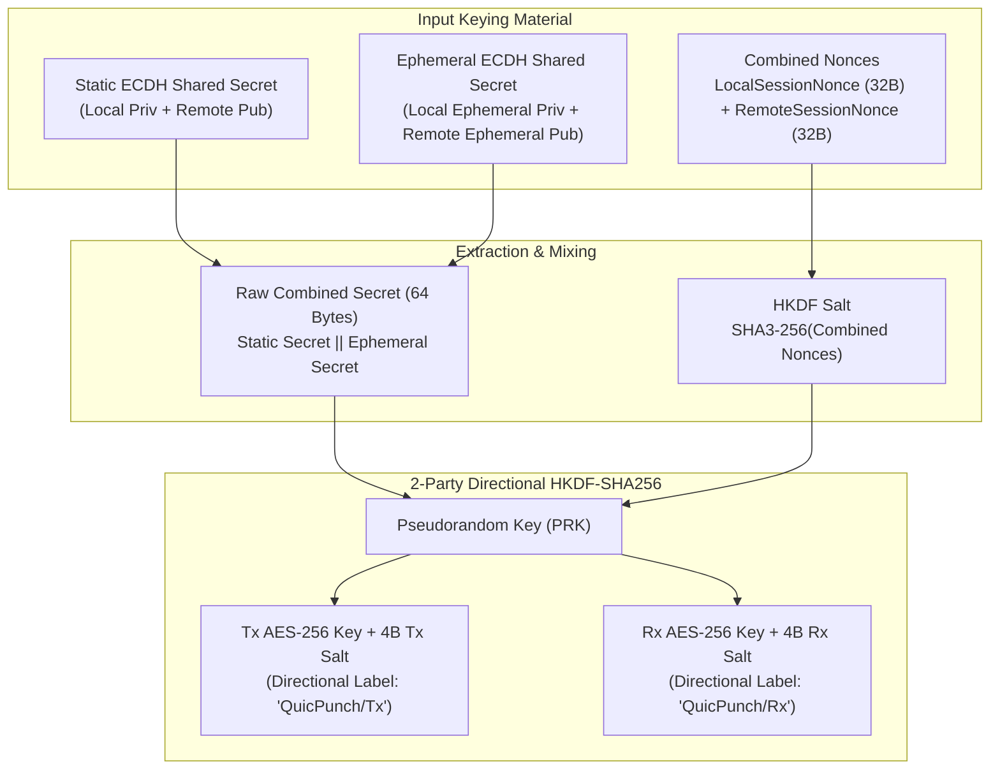

# Cryptography & Security Architecture

> QuicPunch uses state-of-the-art cryptographic primitives conforming to modern standards (.NET 11 cryptography, RFC 6479, RFC 5869, RFC 8032, and BIP-340).

---

### Cryptographic Primitives Matrix

| Component | Cryptographic Primitive | Implementation Details |
| :--- | :--- | :--- |
| **Node Identity** | ECDSA over NIST P-256 (`ECDsa.Create(ECCurve.NamedCurves.nistP256)`) | Self-signed X.509 v3 Certificate with 30-year validity |
| **Identity Fingerprint** | SHA3-256 (`SHA3_256.HashData`) | 32-byte hash of the Subject Public Key Info (SPKI) |
| **Access Control** | Zero-Trust Admission & Ephemeral Sets (`IPeerAccessController`) | Dynamic `ExpectedPeerCertSet`, persistent `PeerStore`, per-peer auto-accept policies |
| **Key Exchange (P2P Control Plane)** | Ephemeral ECDH over NIST P-256 (`ECDiffieHellman`) | Fresh ephemeral keypair generated per session entropy rotation |
| **Key Derivation** | 2-Party HKDF-SHA256 (`HKDF.DeriveKey`) | Combines static ECDH, ephemeral ECDH, local & remote 32-byte nonces |
| **Symmetric Encryption** | AES-GCM-256 (`AesGcm`, 16-byte tag) | Directional ciphers (`TxCipher` & `RxCipher`) with unique salts |
| **Replay Protection** | RFC 6479 128-Packet Sliding Window | Bitmap-based `UInt128` window + monotonic sequence counter |
| **Decentralized Signaling** | BIP-340 64-byte Schnorr Signatures | secp256k1 curve math (Jacobian projective point arithmetic) |
| **Onion Addressing** | Tor v3 Ed25519 (`ED25519-V3`) | Extended Edwards curve point multiplication to 56-char base32 `.onion` |
| **Password Authentication** | HMAC-SHA3-256 Challenge-Response | 24-byte cryptographically secure random nonces |

---

## Session Key Derivation Flow (Control Plane)



### Line-Level Code Implementation in [`PeerInfo.InitSession`](../../QuicPunch/Structures/PeerInfo.cs)
```csharp
byte[] staticSecret = localStaticEcdh.DeriveKeyMaterial(peerPublicKey);
byte[] ephemeralSecret = localEphemeralEcdh.DeriveKeyMaterial(remoteEphemeralPublicKey);
byte[] rawSecret = new byte[staticSecret.Length + ephemeralSecret.Length];
Buffer.BlockCopy(staticSecret, 0, rawSecret, 0, staticSecret.Length);
Buffer.BlockCopy(ephemeralSecret, 0, rawSecret, staticSecret.Length, ephemeralSecret.Length);

byte[] salt = SHA3_256.HashData(combinedNonces);
byte[] keyMaterial = HKDF.DeriveKey(HashAlgorithmName.SHA256, rawSecret, 64, salt, infoLabel);
```

---

## RFC 6479 Sliding Window Anti-Replay Engine

To prevent packet replay attacks over unauthenticated or authenticated UDP channels, QuicPunch implements an RFC 6479 / RFC 4303 128-packet sliding window filter in [`AntiReplayWindow`](../../QuicPunch/Helpers/AntiReplayWindow.cs).

### Data Structure & Bitfield Mechanics
- **Sequence Number Counter**: `ulong _lastSequence` tracks the highest validated sequence number received.
- **128-Bit Sliding Bitmap**: `UInt128 _window` represents the previous 128 sequence numbers.
- **Lock-Free Concurrency**: Uses fast bitwise arithmetic protected by lock synchronization for multithreaded socket reception.

```
       <-- Older packets (Dropped) | [128-bit Sliding Window] | Newer packets -->
  ... -----------------------------|--------------------------|-----------------
                                   ^                          ^
                      (_lastSequence - 128)             _lastSequence
```

### Verification Rules
1. **Sequence == 0**: Instantly rejected.
2. **Sequence > `_lastSequence`**:
   - If diff < 128: Shift bitmap left by `diff` bits, set bit 0 to `1`, update `_lastSequence = sequence`.
   - If diff >= 128: Reset bitmap to `1`, update `_lastSequence = sequence`.
3. **Sequence <= `_lastSequence`**:
   - Calculate `diff = _lastSequence - sequence`.
   - If `diff >= 128`: Packet is outside the window (too old) -> **Rejected**.
   - Check bit `(1 << diff)`:
     - If bit is `1`: Duplicate/replayed packet -> **Rejected**.
     - If bit is `0`: Valid out-of-order packet -> Set bit to `1` -> **Accepted**.

---

## Zero-Trust Admission & Peer Access Control

QuicPunch implements strict zero-trust access control via [`IPeerAccessController`](../../QuicPunch/Security/PeerAccessController.cs) and [`ExpectedPeerCertSet`](../../QuicPunch/Security/PeerAccessController.cs).

### Core Responsibilities
1. **Separation of Signaling & Admission**: Any node can announce itself on Nostr or ping via UDP, but no application session (Chat, Virtual LAN, Voice, RelayDrive) will activate unless authorized.
2. **In-Memory Expected Certificates**: `ExpectedPeerCertSet` stores SHA3-256 certificate hashes of explicitly invited peers (e.g. via pairing tokens or invite links).
3. **Persistent Peer Store Integration**: `IsTrusted(certHash)` validates against both active `ExpectedPeerCerts` and persistent disk entries in [`PeerStore`](../../QuicPunch/Helpers/PeerStore.cs).
4. **Per-Peer Auto-Accept Policies**:
   - `AutoAcceptConnections`: Global policy whether trusted peers are accepted immediately without UI prompt.
   - `AutoAcceptUntrustedConnections`: Highly restricted flag (default `false`) for public hubs.
   - `SetPeerAutoAccept(Guid, bool)`: Granular per-peer auto-accept toggles.
5. **Application Boundary Guard**:
   ```csharp
   peerAccessController.EnsureAllowedForApplication(peer);
   ```
   Throws `UnauthorizedAccessException` if an untrusted peer attempts to open application protocol streams without user consent.

---

## Public Key Fingerprinting & Certificate Pinning

QuicPunch rejects traditional CA hierarchy vulnerabilities by enforcing **cryptographic certificate pinning**:
1. At node initialization, [`CertManager`](../../QuicPunch/Helpers/CertManager.cs) generates a self-signed X.509 ECDSA cert with `ECCurve.NamedCurves.nistP256`.
2. The cert fingerprint is `SHA3_256.HashData(cert.GetPublicKey())`.
3. When establishing a native QUIC connection (`System.Net.Quic`), `RemoteCertificateValidationCallback` extracts the remote public key, computes the SHA3-256 hash, and compares it in **constant time** (`CryptographicOperations.FixedTimeEquals`) against the pinned `peerCertificate` hash.
