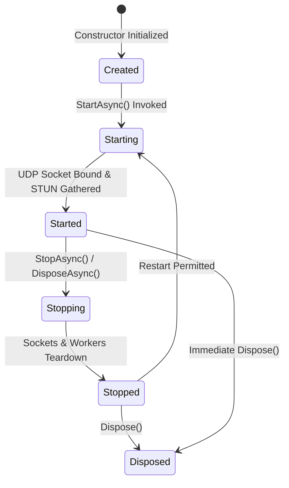
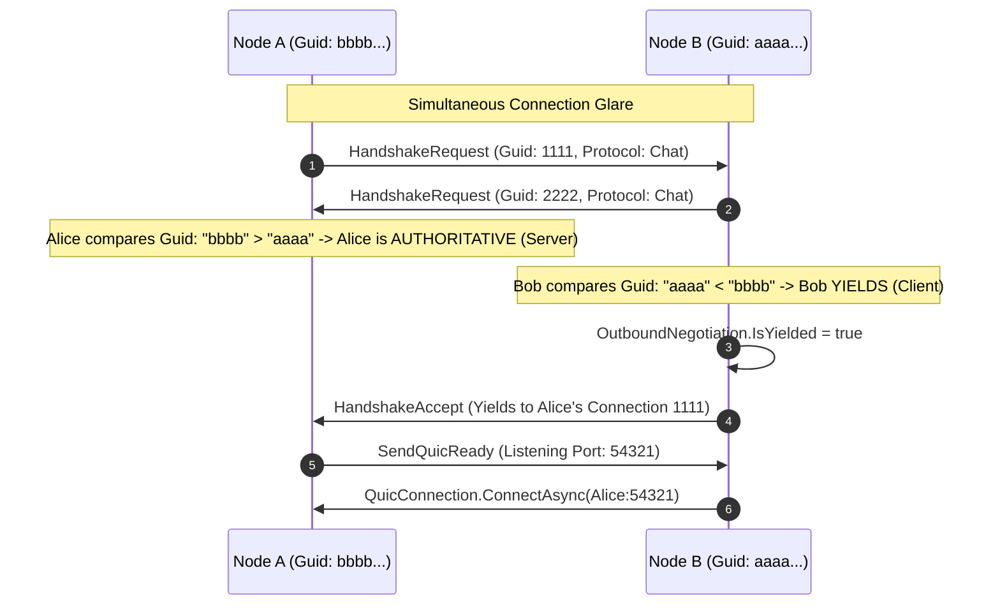

# Lifecycle & Concurrency State Machine

> QuicPunch manages complex background tasks, asynchronous connection flights, periodic token refreshes, and network socket bindings through a strict lifecycle state machine and generational tracking.

---

### Lifecycle State Definitions



| State | Enum Name | Description |
| :--- | :--- | :--- |
| `0` | `Created` | Instance instantiated, certs loaded, no sockets or workers active. |
| `1` | `Starting` | Transitioning: gathering STUN candidates, initializing Tor daemon, binding UDP port. |
| `2` | `Started` | Active: UDP receive loop running, periodic keepalives active, Nostr discovery connected. |
| `3` | `Stopping` | Gracefully terminating active protocol sessions, notifying peers with `DisconnectPacket`. |
| `4` | `Stopped` | Fully quiescent: all network sockets closed and worker threads awaited. |
| `5` | `Disposed` | Terminal state: cryptographic keys zeroed, certificates disposed. |

---

## Generational Tracking (`_lifecycleGeneration`)

To prevent **zombie worker tasks** from a previous session interacting with sockets from a newly started session (e.g. following a network restart or sleep/wake cycle), QuicPunch increments a monotonic `long _lifecycleGeneration`:

```csharp
// Inside StartAsync:
long generation = Interlocked.Increment(ref _lifecycleGeneration);
_lifecycleCts = new CancellationTokenSource();

// Inside background worker loops (e.g. ReceiveUdpLoopAsync, MaintenanceLoopAsync):
private bool IsLifecycleWorkerCurrent(long generation, CancellationToken token) =>
    LifecycleState == QuicPunchLifecycleState.Started &&
    generation == Volatile.Read(ref _lifecycleGeneration) &&
    !token.IsCancellationRequested;
```

---

## Modular Sub-Service Lifecycles (WAN & Tor)

In addition to the global node lifecycle (`StartAsync` / `StopAsync`), QuicPunch features **independent dynamic sub-service lifecycles** that can be started, stopped, or reconfigured at runtime without interrupting the main engine:

```
                  ┌───────────────────────────────┐
                  │   QuicPunch Engine Runtime    │
                  │ (Identity, Peers, Cryptography)│
                  └───────────────┬───────────────┘
                                  │
         ┌────────────────────────┴────────────────────────┐
         ▼                                                 ▼
┌─────────────────────────────────┐       ┌─────────────────────────────────┐
│       WAN UDP Subservice        │       │       Tor Onion Subservice      │
│  - Controlled by _wanLifecycle- │       │  - Controlled by _torLifecycle- │
│    Lock & _wanLoopCts           │       │    Lock & _torLoopCts           │
│  - Methods: StartWanAsync() /   │       │  - Methods: StartTorAsync() /   │
│    StopWanAsync()               │       │    StopTorAsync()               │
│  - Socket: udp (UdpClient)      │       │  - TorDaemon & SOCKS5 Proxy     │
│  - STUN client & NAT mapping    │       │  - TorPeerTransportHub & Lanes  │
│  - WAN Nostr Discovery          │       │  - Tor Nostr Discovery          │
└─────────────────────────────────┘       └─────────────────────────────────┘
```

1. **WAN Subservice (`StartWanAsync` / `StopWanAsync`)**:
   - `StartWanAsync(ushort port = 0)` binds the UDP listener socket, launches `ReceiveUdpLoopAsync`, initializes STUN discovery, and connects WAN Nostr relays.
   - `StopWanAsync()` cleanly disposes the UDP socket, resets NAT mappings, stops STUN loops, invalidates the WAN token cache, and disconnects WAN Nostr discovery while preserving peer identity and cryptographic sessions.
2. **Tor Subservice (`StartTorAsync` / `StopTorAsync`)**:
   - `StartTorAsync(int virtualPort = 443)` manages the Tor process, configures hidden service authorization, listens on the onion address, and initiates Tor Nostr signaling.
   - `StopTorAsync()` shuts down hidden services and disconnects Tor transports cleanly.

---

## Outbound Negotiation & Glare Arbitration



### Key Concurrency Collections in [`QuicPunch.cs`](../../QuicPunch/QuicPunch.cs)
1. **`_activeConnectionFlights`**: `ConcurrentDictionary<(Guid PeerId, Guid ProtocolId), ConnectionFlight>`
   - Ensures that only **one connection attempt** per peer per protocol runs at any instant.
   - Secondary callers await the existing `ConnectionFlight.Task`.
2. **`_activeOutboundNegotiations`**: `ConcurrentDictionary<(Guid PeerId, Guid ProtocolId), OutboundNegotiation>`
   - Coordinates multi-step candidate exchange and timeout cancellation.
3. **`_activeProtocolSessions`**: `ConcurrentDictionary<(Guid PeerId, Guid ProtocolId), (QuicConnection Connection, Stream Stream)>`
   - Maps active established protocol sessions. If a new session arrives, previous streams are disposed gracefully.
