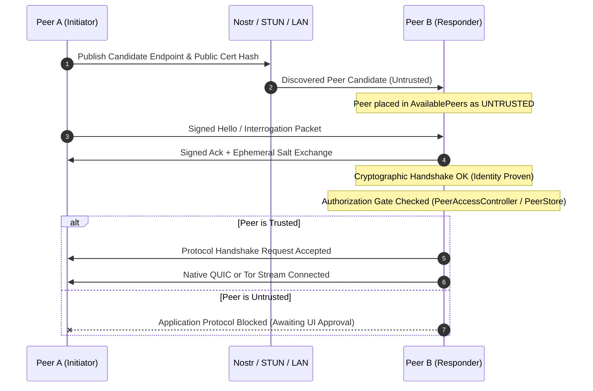

# Architecture Overview

> **QuicPunch** delivers a seamless dual-stack peer-to-peer transport engine that provides low-latency, encrypted, direct UDP/QUIC connectivity across complex NAT and firewall topologies, with an automated, zero-configuration Tor v3 Hidden Service fallback.

---

### Specification & Key Properties

| Characteristic | Architecture Detail |
| :--- | :--- |
| **Layer Pattern** | Zero-Trust Control/Data Plane Separation with Multiplexed Protocols |
| **Primary Transport** | UDP Datagrams + `System.Net.Quic` (RFC 9000 / RFC 9001 TLS 1.3) + RFC 9221 Datagrams |
| **Native MsQuic Tuning** | Deep reflection runtime control on Linux & Windows (dynamic BBR congestion control, DSCP QoS voice/video tagging, microsecond stats) |
| **Fallback Transport** | Tor v3 Onion Services (`.onion`) over SOCKS5 & TCP Multi-Lane Emulation |
| **NAT Traversal & Port Forwarding** | Cascaded Gateway Mapping (PCP RFC 6887 -> NAT-PMP RFC 6886 -> UPnP IGD) + NAT Pinhole Burst Discovery + Simultaneous UDP Hole Punching |
| **Signaling Channels** | Nostr Relays (NIP-01 / Kind 27227), Base64 Tokens, LAN Multicast |
| **Target Runtime** | .NET 11.0 / C# 14 with Nullable Reference Types & Span optimizations |

---

## Layered System Architecture

```mermaid
graph TD
    subgraph AppLayer [" Layer 4: Application Protocol Handlers (IProtocolHandler)"]
        Chat[" ChatHandler"]
        LAN[" VirtualLanHandler (Wintun)"]
        Voice[" VoiceCallHandler (Opus 48kHz + Datagrams)"]
        Drive[" RelayDriveHandler"]
    end

    subgraph QuicLayer [" Layer 3: Connection & Multiplexing Engine"]
        NativeQuic["System.Net.Quic (mTLS WAN)"]
        MsTuner["MsQuicTuner (BBR Congestion / DSCP QoS)"]
        DgramChan["MsQuicDatagramChannel (RFC 9221 Unbuffered Datagrams)"]
        TorQuic["TorQuicConnectionManager (Tor Emulated QUIC)"]
        SessionReg["Session & Glare Arbiter (_activeProtocolSessions)"]
    end

    subgraph SecLayer [" Layer 2: Cryptographic Identity & Control Plane"]
        CertMgr["CertManager (Self-Signed X.509 + ECDH)"]
        AccessCtrl["PeerAccessController (Zero-Trust Admission & ExpectedCertSet)"]
        PeerStore["PeerStore (Atomic Pinning DB)"]
        AntiReplay["AntiReplayWindow (RFC 6479 128-bit Sliding)"]
        HKDF["HKDF Key Derivation (Tx/Rx AES-GCM-256)"]
    end

    subgraph NetLayer [" Layer 1: Physical & Overlay Transports"]
        SocketUdp["UdpClient (SO_REUSEADDR, IOControl SIO_UDP_CONNRESET)"]
        StunClient["SimpleStunClient (RFC 5389 Binary Parser)"]
        NatPin["NatPinCoordinator (Burst Probing & Keepalives)"]
        PortMap["PortMappingCoordinator (PCP / NAT-PMP / UPnP)"]
        TorRuntime["TorRuntimeManager (Embedded Daemon + SAFECOOKIE)"]
        NostrSig["NostrDiscovery (secp256k1 BIP-340 Schnorr)"]
    end

    AppLayer --> QuicLayer
    QuicLayer --> SecLayer
    SecLayer --> NetLayer
```

---

## Dual-Stack Transport Design Philosophy

### 1. The Direct UDP/QUIC Fast Path
- **High Throughput & Low Latency**: Native QUIC streams run over kernel UDP sockets.
- **RFC 5389 STUN Discovery & NAT Bursting**: Rapidly discovers Server-Reflexive public IP/port candidates and measures NAT mapping delta behaviors.
- **Cascaded Port Mapping**: Attempts zero-roundtrip gateway mappings via PCP, NAT-PMP, and UPnP IGD before fallback hole-punching.
- **Simultaneous Hole Punching**: Both endpoints initiate UDP bursts to each other's candidate endpoints simultaneously, punching bi-directional state into stateful NAT firewalls.
- **Port Reuse (`SO_REUSEADDR`)**: The exact same local port that executed the hole punch is immediately handed over to `QuicListener` / `QuicConnection`.
- **Dynamic BBR & QoS**: Native MsQuic handles are inspected via reflection to activate BBR congestion control and DSCP packet prioritization on Linux and Windows.
- **RFC 9221 Datagrams**: Low-latency voice audio is transmitted directly via unbuffered, out-of-order QUIC datagrams with zero head-of-line blocking.

### 2. The Tor v3 Onion Mesh Fallback
- **Universal Traversal**: When symmetric NATs, Carrier-Grade NAT (CGNAT), or enterprise deep packet inspection (DPI) block UDP, Tor provides guaranteed end-to-end connectivity without third-party centralized relay servers.
- **Zero Configuration**: Downloads, verifies (SHA-256), and manages an isolated portable Tor Expert Bundle process in the background.
- **Interface Parity**: Application handlers implement `IProtocolHandler` and receive a standard `QuicConnection` and `Stream` whether the underlying transport is native WAN or Tor.

---

## Zero-Trust Security Invariant: Discovery ≠ Authorization

> [!IMPORTANT]
> **Discovery Only Establishes Candidate Identity**: Receiving a packet or discovering an endpoint via Nostr, Port Mapping, or LAN creates an **untrusted candidate**. Application protocols, file transfers, virtual LAN traffic, and chat messages are **never** delivered until the peer's certificate hash is explicitly trusted via [`PeerAccessController`](../../QuicPunch/Security/PeerAccessController.cs), [`PeerStore`](../../QuicPunch/Helpers/PeerStore.cs), or UI confirmation.

---

## Concurrency & Simultaneous Glare Arbitration

When two peers attempt to initiate a connection to each other for the same protocol simultaneously (known as **glare**), QuicPunch resolves the race deterministically:

1. **Lexicographical Tie-Breaking**: Peers compare `CurrentPeer.Id` against `remotePeer.Id` (or their `CertHash` strings).
2. **Authoritative vs Yielding Role**:
   - The node with the **higher Guid** is designated authoritative (acting as QUIC Server).
   - The node with the **lower Guid** yields cleanly (`IsYielded = true`) and acts as QUIC Client.
3. **Single-Flight Coordination**: `_activeConnectionFlights` prevents duplicate connection attempts for the same `(PeerId, ProtocolId)` tuple.
