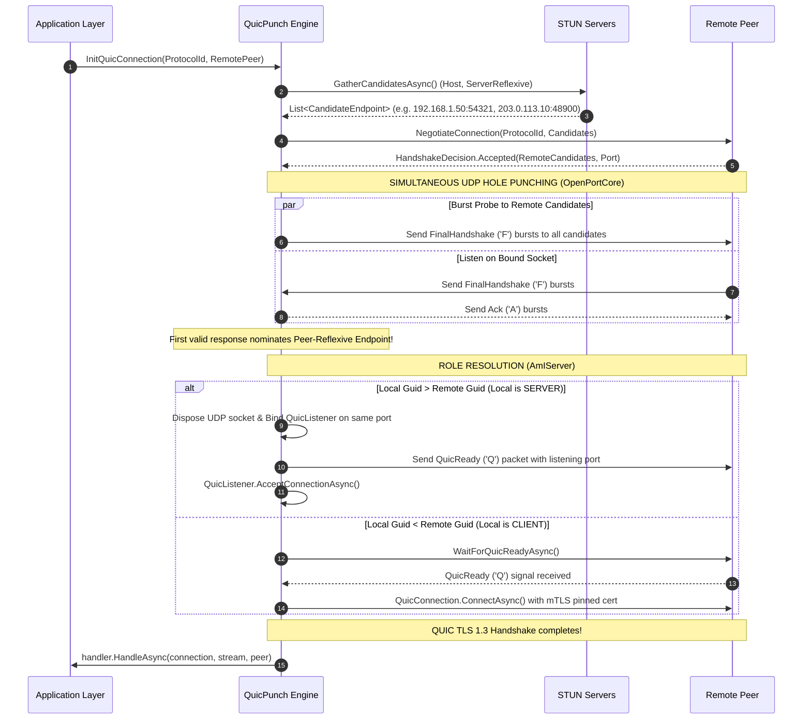

# Connection Establishment & UDP Hole Punching

> QuicPunch achieves direct P2P connectivity through stateful NATs using an ICE-inspired candidate gathering and racing algorithm, followed by mTLS-secured QUIC tunnel establishment.

---

## Complete Hole Punching & QUIC Sequence

---

## Step-by-Step Code Walkthrough

### 1. Candidate Gathering in [`SimpleStunClient.GatherCandidatesAsync`](../../QuicPunch/Discovery/SimpleStunClient.cs)
- Binds a UDP socket with `SocketOptionName.ReuseAddress = true`.
- Concurrently queries multiple public STUN servers (e.g., `stun.l.google.com:19302`, `stun1.l.google.com:19302`).
- Assembles local host interfaces and server-reflexive public IP/ports, filtering out bogon/loopback IPs.

### 2. Simultaneous Hole Punching in [`QuicPunchConnection.OpenPortCore`](../../QuicPunch/QuicPunchConnection.cs)
- Spawns background task `SendLoopAsync`, sending `FinalHandshake` packets to all target endpoints every `125ms`.
- Awaits first matching packet in `ReceiveHoleLoopAsync`.
- Responds with 4 `Ack` bursts and nominates the winning `remoteEndpoint`.

### 3. Server Listener Handoff in [`QuicPunchConnection.TryRunServer`](../../QuicPunch/QuicPunchConnection.cs)
- Disposes the initial hole-punch UDP socket.
- Binds `QuicListener` on `IPAddress.Any` and `localPort`.
- Sends signed `QuicReady` message to remote peer via `SendQuicReadyAsync`.
- Accepts native inbound QUIC connection and bidirectional stream.

### 4. Client Connection in [`QuicPunchConnection.TryRunClient`](../../QuicPunch/QuicPunchConnection.cs)
- Awaits `WaitForQuicReadyAsync` notification from the server.
- Connects to server endpoint with exponential backoff (`50ms` -> `400ms`).
- Injects client certificate in `ClientAuthenticationOptions`.
- Validates server certificate hash in `RemoteCertificateValidationCallback`.

---

## RFC 9221 Unbuffered Datagrams (`MsQuicDatagramChannel`)

For ultra-low-latency, real-time protocols such as Voice Calls, head-of-line blocking from reliable QUIC streams is unacceptable. QuicPunch integrates [`MsQuicDatagramChannel`](../../QuicPunch/Helpers/MsQuicDatagrams.cs), enabling **RFC 9221 Unreliable QUIC Datagrams** on top of `System.Net.Quic` in .NET 11:

- **Native MsQuic API Table Interception**: Hooks into `DatagramSend` and `NativeCallback` via native function pointers.
- **Dynamic Configuration Patching**: Patches `QUIC_SETTINGS.DatagramReceiveEnabled` directly in the native configuration cache so that both endpoints negotiate datagram capability during the initial TLS 1.3 handshake.
- **Unbuffered Async Channels**: Received datagrams are queued directly into high-throughput, lock-free `Channel<byte[]>` reader pipelines.
- **Zero Head-of-Line Blocking**: Packet loss drops the audio frame without stalling subsequent audio frames, providing instantaneous, glitch-free voice communications.
