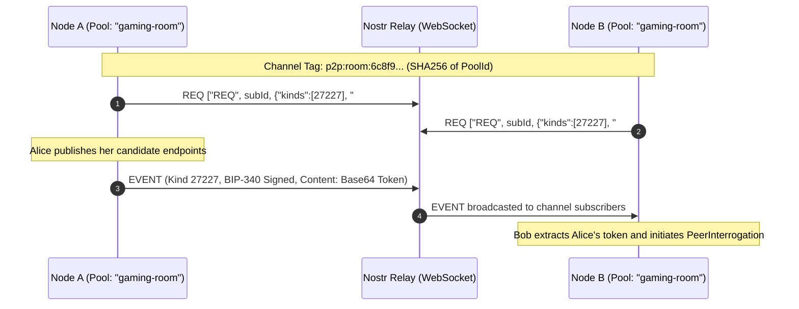

# Nostr Decentralized Signaling & BIP-340 Schnorr

> QuicPunch uses the Nostr protocol (NIP-01) as a serverless, censorship-resistant signaling plane. It includes a complete, high-performance cryptographic implementation of BIP-340 Schnorr signatures on the secp256k1 elliptic curve.

---

### Nostr Protocol Specification

| Property | Value |
| :--- | :--- |
| **Nostr Event Kind** | `27227` (Ephemeral P2P Signaling Event) |
| **Channel Tag** | `p2p:room:<SHA256_HEX(PoolId)>` |
| **Curve** | secp256k1 ($y^2 = x^3 + 7 \pmod p$) |
| **Signature Format** | 64-byte BIP-340 Schnorr Signature ($R_x || s$) |
| **Payload Format** | Base64-encoded encrypted token or plain candidate rendezvous |
| **Default Relays** | `wss://purplerelay.com`, `wss://nostr.oxtr.dev`, `wss://relay.primal.net`, `wss://offchain.pub`, `wss://nostr.bitcoiner.social` |

---

## Pure C# BIP-340 secp256k1 Implementation

[`NostrDiscovery.cs`](../../QuicPunch/Discovery/NostrDiscovery.cs) includes a self-contained elliptic curve engine avoiding external C native libraries:

### Mathematical Structures & Optimizations
1. **Jacobian Projective Coordinates**: Points are represented as $(X : Y : Z)$ where $x = X/Z^2$ and $y = Y/Z^3$, eliminating expensive modular inversions during scalar multiplication.
2. **Field Prime**: $p = 2^{256} - 2^{32} - 977$.
3. **Curve Order**: $n = 	ext{0xFFFFFFFFFFFFFFFFFFFFFFFFFFFFFFFEBAAEDCE6AF48A03BB5BF58097632615B}$.
4. **BIP-340 Tagged Hashes**:
   - `tagged_hash(tag, msg) = SHA256(SHA256(tag) || SHA256(tag) || msg)`
   - Computes tags for `BIP0340/challenge`, `BIP0340/nonce`, and `BIP0340/aux`.

---

## Nostr Signaling Event Flow

