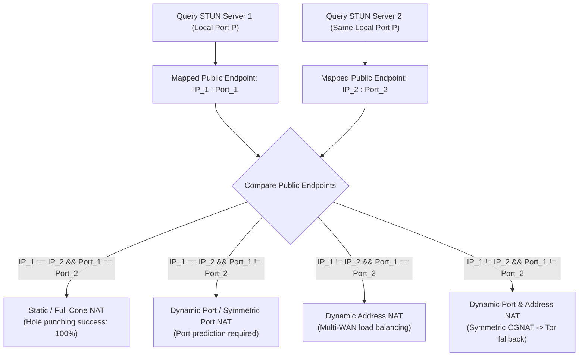
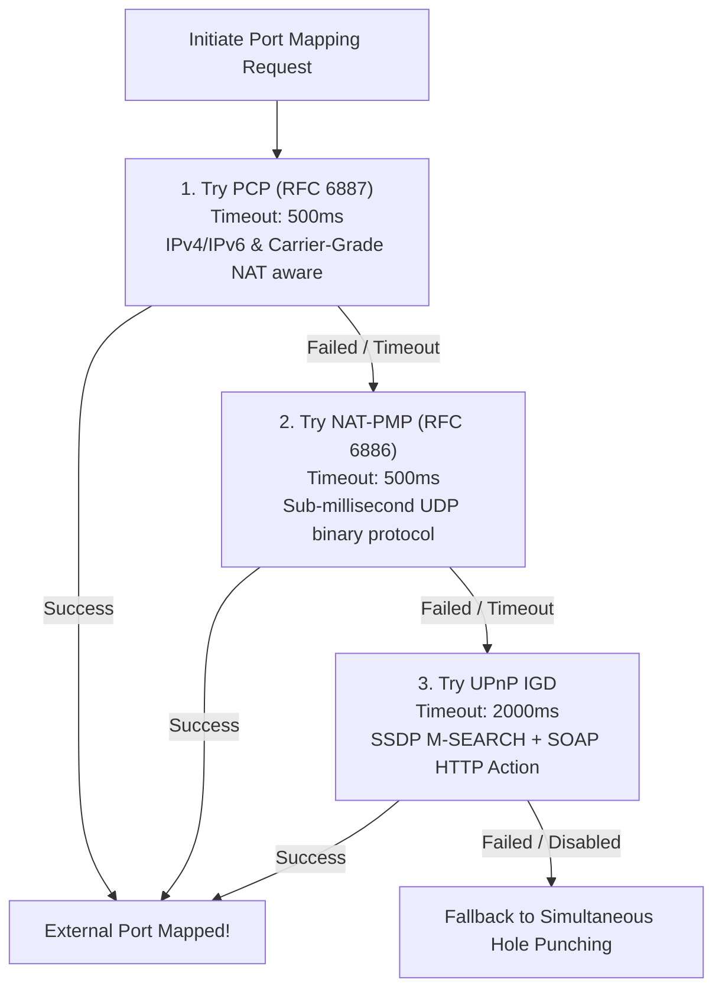

# STUN & NAT Traversal Engine

> QuicPunch incorporates a built-in RFC 5389 STUN client, a high-frequency STUN burst sampling engine (`NatPinCoordinator`), a 3-tier gateway port mapping cascade (`PortMappingCoordinator`), and binary candidate caching.

---

### Discovery Components Breakdown

| Class | File | Responsibility |
| :--- | :--- | :--- |
| [`SimpleStunClient`](../../QuicPunch/Discovery/SimpleStunClient.cs) | `Discovery/SimpleStunClient.cs` | Fast binary STUN RFC 5389 message builder, parser, and NAT classification engine. |
| [`PortMappingCoordinator`](../../QuicPunch/Discovery/PortMapping/PortMappingCoordinator.cs) | `Discovery/PortMapping/PortMappingCoordinator.cs` | Cascaded gateway mapper: PCP (RFC 6887) -> NAT-PMP (RFC 6886) -> UPnP IGD. |
| [`NatPinCoordinator`](../../QuicPunch/Discovery/NatPinCoordinator.cs) | `Discovery/NatPinCoordinator.cs` | Burst STUN probing across 32+ servers, port delta variance learning, and pinhole keepalives. |
| [`StunGatherer`](../../QuicPunch/Discovery/StunGatherer.cs) | `Discovery/StunGatherer.cs` | Built-in STUN catalog, remote list downloader, and cache manager. |
| [`EndpointCache`](../../QuicPunch/Discovery/EndpointCache.cs) | `Discovery/EndpointCache.cs` | Binary disk cache (`QPEP` v1) with TTL validation and SHA-256 integrity verification. |

---

## Binary RFC 5389 Packet Structure

```
 0                   1                   2                   3
 0 1 2 3 4 5 6 7 8 9 0 1 2 3 4 5 6 7 8 9 0 1 2 3 4 5 6 7 8 9 0 1
+-+-+-+-+-+-+-+-+-+-+-+-+-+-+-+-+-+-+-+-+-+-+-+-+-+-+-+-+-+-+-+-+
|0 0|     STUN Message Type     |         Message Length        |
+-+-+-+-+-+-+-+-+-+-+-+-+-+-+-+-+-+-+-+-+-+-+-+-+-+-+-+-+-+-+-+-+
|                         Magic Cookie                          |
|                          0x2112A442                           |
+-+-+-+-+-+-+-+-+-+-+-+-+-+-+-+-+-+-+-+-+-+-+-+-+-+-+-+-+-+-+-+-+
|                                                               |
|                 Transaction ID (12 Bytes)                     |
|                                                               |
+-+-+-+-+-+-+-+-+-+-+-+-+-+-+-+-+-+-+-+-+-+-+-+-+-+-+-+-+-+-+-+-+
```

### Supported STUN Attributes in [`SimpleStunClient.cs`](../../QuicPunch/Discovery/SimpleStunClient.cs)
1. **`MAPPED-ADDRESS` (`0x0001`)**: Legacy IPv4/IPv6 address.
2. **`XOR-MAPPED-ADDRESS` (`0x0020`)**: Obfuscated XOR IP and Port (XORed with `0x2112A442` and Transaction ID) to prevent NAT ALG rewriting.
3. **`OTHER-ADDRESS` (`0x802C`)**: Alternate server IP/port used for NAT behavior classification.

---

## NAT Behavior Classification Matrix

[`SimpleStunClient.DetermineNatTypeAsync`](../../QuicPunch/Discovery/SimpleStunClient.cs) queries multiple independent STUN servers on the same local UDP port to detect the NAT mapping behavior:



---

## Cascaded Gateway Port Mapping (`PortMappingCoordinator`)

When running on local networks with router gateway support, opening an explicit external port mapping eliminates hole-punch latency. [`PortMappingCoordinator`](../../QuicPunch/Discovery/PortMapping/PortMappingCoordinator.cs) implements a 3-tier cascade:



---

## STUN Burst Sampling & Pinhole Maintenance (`NatPinCoordinator`)

[`NatPinCoordinator`](../../QuicPunch/Discovery/NatPinCoordinator.cs) maintains firewall pinhole health and accurately models dynamic NAT behavior:
- **Burst Batching**: Dispatches 32 concurrent STUN requests (`DefaultBurstBatchSize = 32`) across independent public STUN servers every 1.5 seconds.
- **Port Variance Tracking**: Records min, max, and `MostUsedPort`, detecting whether the router allocates contiguous port ranges or random jumps.
- **Sliding History**: Retains the last 3 burst samples (`HistoryCapacity = 3`) to filter out transient packet loss or network flapping.
- **Pinhole Keepalives**: Periodic bursts ensure outbound firewall translation tables never expire state while an application is idle.
