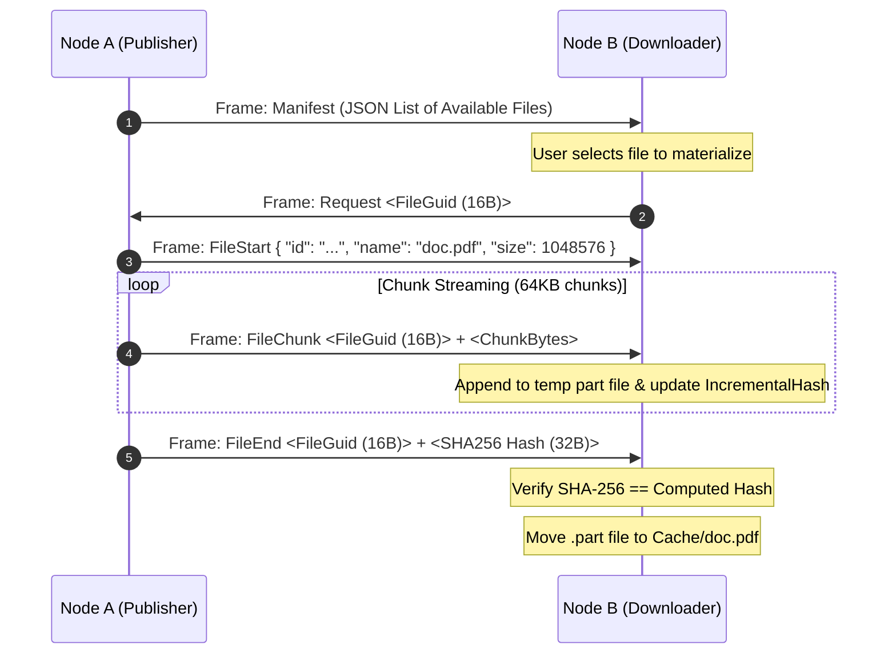

# RelayDrive: Ephemeral P2P File Shelf

> [`RelayDriveHandler`](../../QuicPunchTests/Protocols/RelayDriveHandler.cs) provides a decentralized, temporary file shelf. Peers exchange manifests and stream chunks on-demand without central servers.

---

### Protocol Specification

| Property | Value |
| :--- | :--- |
| **Protocol GUID** | `00000000-0000-0000-0000-000000000005` |
| **Max File Size** | `2 GiB` per file |
| **Max Published Files** | `128` files per node |
| **Chunk Size** | `64 KiB` streaming chunks |
| **Integrity** | SHA-256 Incremental Hash Verified at `FileEnd` |

---

## File Transfer Sequence & Framing

