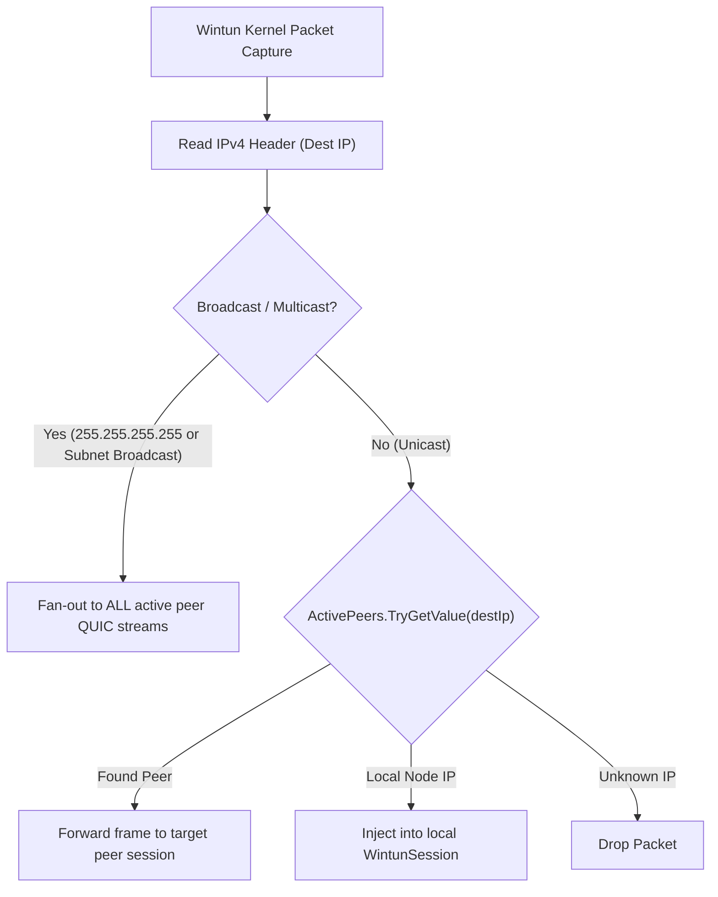

# Virtual LAN Bridge Protocol

> [`VirtualLanHandler`](../../QuicPunchTests/Protocols/VirtualLanHandler.cs) creates a software-defined mesh LAN connecting multiple nodes through Wintun virtual adapters.

---

### Protocol Specification

| Property | Value |
| :--- | :--- |
| **Protocol GUID** | `00000000-0000-0000-0000-000000000002` |
| **Tunnel Layer** | Layer 3 (IPv4 Packets) |
| **Framing** | 2-byte little-endian packet length prefix + Raw IPv4 Frame |
| **IP Allocation** | Deterministic Auto-Assignment (`10.203.<Subnet>.<Host>`) or Manual Static IP |
| **Default MTU** | `1500` (Configurable from `1200` to `9000`) |

---

## Deterministic IP Assignment Algorithm

To avoid IP collisions and DHCP requirements in decentralized mesh networks, [`VirtualLanHandler.ComputeAutomaticIp`](../../QuicPunchTests/Protocols/VirtualLanHandler.cs) computes an invariant IPv4 address from the node's cryptographic certificate fingerprint:

```csharp
public static IPAddress ComputeAutomaticIp(byte[] identityHash, byte[]? groupId = null)
{
    byte[] hostDigest = SHA256.HashData(identityHash);
    byte host = (byte)(1 + (hostDigest[0] % 253)); // Range: 1..254 (Excludes 0 network and 255 broadcast)

    byte subnet = 42;
    if (groupId is { Length: > 0 })
        subnet = SHA256.HashData(groupId)[0];

    return new IPAddress(new byte[] { 10, 203, subnet, host });
}
```

---

## Packet Switching & Broadcast Relaying


