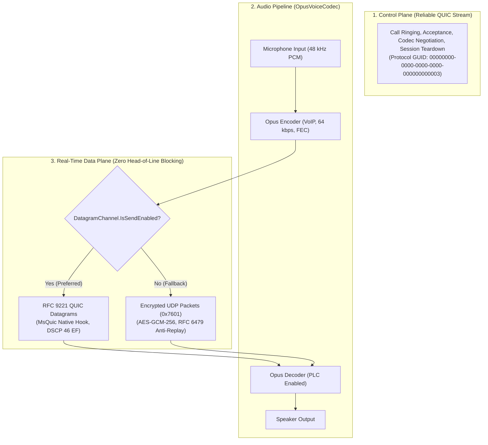

# Low-Latency Voice Call Protocol

> [`VoiceCallHandler`](../../QuicPunchTests/Protocols/VoiceCallHandler.cs) implements a hybrid control/data plane architecture designed for real-time audio, combining RFC 9221 QUIC Datagrams with the pure C# Concentus Opus audio codec.

---

### Protocol Specification

| Property | Value | Code Definition |
| :--- | :--- | :--- |
| **Protocol GUID** | `00000000-0000-0000-0000-000000000003` | [`VoiceCallHandler.ProtocolId`](../../QuicPunchTests/Protocols/VoiceCallHandler.cs) |
| **Protocol Name** | `VoiceCall` | [`VoiceCallHandler.ProtocolName`](../../QuicPunchTests/Protocols/VoiceCallHandler.cs) |
| **Audio Codec** | Concentus Opus 48 kHz VoIP (`OpusVoiceCodec`) | 60ms frames, in-band FEC, 10% packet loss concealment |
| **Primary Data Plane** | RFC 9221 QUIC Datagrams (`MsQuicDatagramChannel`) | Hardware DSCP 46 (Voice EF) prioritized, unbuffered, TLS-encrypted |
| **Fallback Data Plane** | Encrypted UDP Datagrams (`VoicePacketType = 0x7601`) | AES-GCM-256 encrypted frames via [`QuicPunch.SendPayloadAsync`](../../QuicPunch/QuicPunch.cs) |
| **Max Voice Frame Size** | `64 KiB` (`65,536 bytes`) | [`VoiceCallHandler`](../../QuicPunchTests/Protocols/VoiceCallHandler.cs) |
| **Control Plane** | Reliable `QuicConnection` & `QuicStream` | Lifecycle, call signaling, keepalive, and session teardown |

---

## Hybrid Plane Architecture

### Why a Hybrid Plane?
1. **Zero Head-of-Line Blocking**: In TCP and standard QUIC reliable streams, a single lost audio packet stalls all newer incoming frames until retransmitted. In real-time voice, late frames are useless and induce audible stutter.
2. **Hardware QoS Prioritization**: Under MsQuic native tuning, audio datagrams are tagged with DSCP 46 (`DscpTag.Voice_EF`), granting them top queue priority across corporate and ISP routers.
3. **Resilience with In-Band FEC**: `OpusVoiceCodec` includes forward error correction bits, allowing the receiver to reconstruct lost packets without retransmissions even over 10% packet drop networks.
