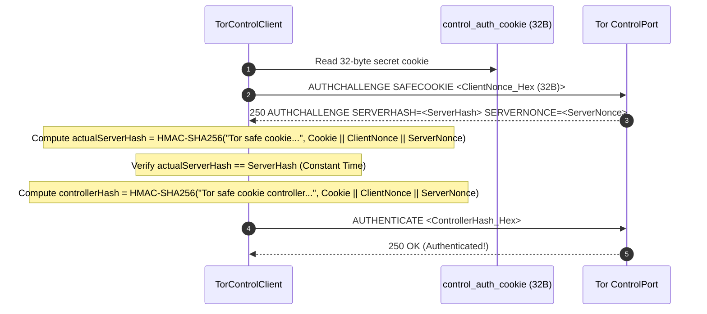

# Tor Subsystem: Daemon Management & Hidden Services

> QuicPunch embeds a fully automated, portable Tor v3 Hidden Service subsystem. If WAN UDP hole punching fails, QuicPunch routes connections through an isolated, zero-privilege Tor daemon.

---

### Tor Subsystem Classes

| Class | File | Responsibility |
| :--- | :--- | :--- |
| [`TorRuntimeManager`](../../QuicPunch/Tor/TorRuntimeManager.cs) | `Tor/TorRuntimeManager.cs` | Portable bundle downloader, tar.gz extractor, process supervisor, and log monitor. |
| [`TorControlClient`](../../QuicPunch/Tor/TorControlClient.cs) | `Tor/TorControlClient.cs` | RFC-compliant Tor ControlPort client (`AUTHCHALLENGE SAFECOOKIE`, `ADD_ONION`, `DEL_ONION`, `SIGNAL`). |
| [`TorManager`](../../QuicPunch/Tor/TorManager.cs) | `Tor/TorManager.cs` | High-level SOCKS5 connection factory with stream isolation (`<torS0X>0`). |
| [`TorIdentity`](../../QuicPunch/Tor/TorIdentity.cs) | `Tor/TorIdentity.cs` | Pure C# Ed25519 scalar multiplication to derive 56-char base32 `.onion` addresses. |
| [`TorOnionService`](../../QuicPunch/Tor/TorOnionService.cs) | `Tor/TorOnionService.cs` | Represents an active v3 Onion Service hosting local TCP port forwarders. |
| [`TorTcpConnection`](../../QuicPunch/Tor/TorTcpConnection.cs) | `Tor/TorTcpConnection.cs` | Stream wrapper supporting half-close (`SocketShutdown.Send`) and aborts. |

---

## Portable Tor Runtime Extraction & Verification

[`TorRuntimeManager.cs`](../../QuicPunch/Tor/TorRuntimeManager.cs) enforces strict binary supply chain security:
1. **Pinned Bundle Version**: Downloads official `tor-expert-bundle` version `15.0.19` (Tor `0.4.9.11`).
2. **SHA-256 Hash Verification**:
   - Windows x64: `6ac067402c7b4a3dc37887ed3754b3914b67fdc220c966190683e9ccf91abf0f`
   - Linux x64: `5a8f19f5f119b5fa2a8fd799a3a532e3236ad36164241800d6302e32f0e1c2a9`
3. **Safe Tar Extraction**: Validates archive paths against path traversal vulnerabilities (Zip Slip defense).
4. **Dynamic Configuration (`quicpunch.torrc`)**:
   ```ini
   ClientOnly 1
   DataDirectory "<LocalAppData>/QuicPunch/TorData"
   SocksPort 127.0.0.1:0 IsolateSOCKSAuth
   ControlPort 127.0.0.1:0
   CookieAuthentication 1
   CookieAuthFile "<LocalAppData>/QuicPunch/TorData/control_auth_cookie"
   __OwningControllerProcess <ProcessId>
   Log notice stdout
   ```

---

## SAFECOOKIE Challenge-Response Handshake


