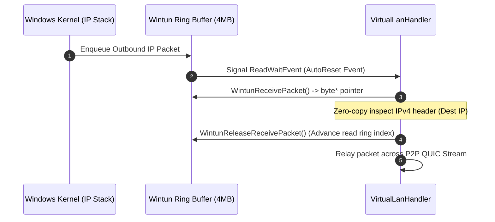

# Wintun Virtual Network Adapter

> The `Wintun` project provides a high-performance C# P/Invoke wrapper around `wintun.dll`, the official WireGuard virtual TUN adapter driver for Windows.

---

### Wintun Architecture Classes

| Class | File | Responsibility |
| :--- | :--- | :--- |
| [`WintunApi`](../../Wintun/WintunApi.cs) | `Wintun/WintunApi.cs` | Native P/Invoke definitions for all `wintun.dll` exported functions. |
| [`WintunAdapter`](../../Wintun/WintunAdapter.cs) | `Wintun/WintunAdapter.cs` | Managed handle to a virtual network adapter (`WintunCreateAdapter`, LUID lookup, session creation). |
| [`WintunSession`](../../Wintun/WintunSession.cs) | `Wintun/WintunSession.cs` | High-speed ring-buffer reader and writer with kernel event synchronization. |
| [`WintunLogger`](../../Wintun/WintunLogger.cs) | `Wintun/WintunLogger.cs` | Interop callback forwarder capturing driver kernel log messages. |

---

## Zero-Copy Ring Buffer Packet I/O

### Key API Methods
1. **`WintunStartSession(adapter, capacity)`**: Starts a ring buffer session. Capacity must be a power of two between `128 KiB` and `64 MiB` (default is `16 MiB`).
2. **`WintunGetReadWaitEvent(session)`**: Returns a Win32 event handle signaled whenever new packets arrive.
3. **`WintunAllocateSendPacket(session, packetSize)`**: Allocates memory directly inside the send ring buffer, avoiding unnecessary buffer copies.
